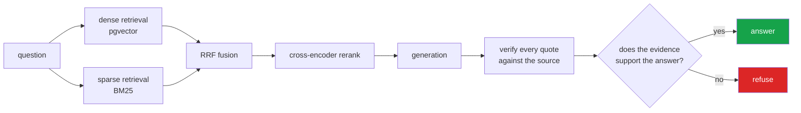

<h1 align="center">rag-forge (FastAPI · PostgreSQL + pgvector · sentence-transformers · Anthropic API)</h1>
<p align="center"><i>Production RAG that refuses to guess</i></p>

<p align="center">
  <a href="#what-makes-it-different">What makes it different</a> &middot;
  <a href="#architecture">Architecture</a> &middot;
  <a href="#try-it-without-installing-anything">Try it</a> &middot;
  <a href="#results">Results</a> &middot;
  <a href="#problems-hit-while-building-this">Problems hit</a>
</p>

<p align="center">
  <a href="https://github.com/hammasbuilds/rag-forge/actions/workflows/ci.yml"></a>
  
  
  
  <a href="LICENSE"></a>
</p>

---

## What makes it different



Most RAG demos answer every question. The gate is the part that makes this different: when
the retrieved evidence does not support an answer, it says so instead of generating one.


| | |
|---|---|
| **Verified citations** | The model returns quotes; each quote is *located in the actual source text* before it becomes a citation, and converted to a character span of the original document. Quotes that cannot be located are dropped — and a dropped quote is a hallucination signal. |
| **A real refusal path** | Three independent grounds for refusing: the model reporting no support, a grounding score under threshold, or every quote failing verification. Any one is enough. |
| **One datastore** | Postgres 17 holds both the `vector(1024)` HNSW index and the `tsvector` GIN index. Hybrid search without running a second search engine. |
| **Swappable LLM** | `LLM_BACKEND=ollama` (free, local, on your own GPU) or `anthropic`. Nothing above `llm.py` knows which is active. |
| **Measured, not claimed** | `make eval` writes `RESULTS.md` — hit@k, MRR, answer match, refusal rate, correct-refusal rate, p50/p95 latency. |

## Architecture

```
        ingest                      query
          │                           │
   readers (pdf/md/txt)          embed query
          │                           │
   structure-aware chunker    ┌───────┴────────┐
   (keeps char offsets)       │                │
          │              dense (HNSW)    sparse (GIN tsvector)
      bge-m3 embed            └───────┬────────┘
          │                     RRF fusion (k=60)
          ▼                           │
   ┌──────────────┐          cross-encoder rerank
   │  Postgres 17 │◄────┐            │
   │   + pgvector │     │      LLM (ollama │ anthropic)
   └──────────────┘     │            │
                        │     quote verification
                     Redis            │
                    (cache)   grounding gate ──► answer + citations
                                      └────────► refusal
```

Character offsets survive the whole pipeline. That invariant is what makes a citation
point at *characters 4102–4288 of contracts.pdf* rather than "document 3", and it is
covered by a test.

## Try it without installing anything

| | |
|---|---|
| **Live demo** | Hugging Face Space — ask a question in the browser, no setup |
| **Open in Codespaces** | one click, full repo running in VS Code in the browser |
| **Clone and run** | `make app` — whole stack in Docker, CPU models |

The demo runs the same code as the production path. Only two things change,
both by configuration: the store is SQLite instead of Postgres, and generation
goes through hosted inference instead of a local GPU model. That portability is
why `store/` and `llm.py` are interfaces rather than direct calls.

---

## Input


## Output

`python demo.py`


*The third quote cites the wrong passage number and verifies anyway — a real quote with a
bad index is still a real quote, so it is located by searching every retrieved passage.*

*The fourth is the one that matters. It is fluent, it is shaped exactly like the other
three, and it appears in neither source. Nothing about its wording distinguishes it from
a genuine citation; only looking for it in the text does.*

---

## Quick start

```bash
make up          # Postgres + Redis
make install     # uv sync, creates .venv
cp .env.example .env
make ingest      # indexes the seed corpus in data/raw/
make ask Q="What does Reciprocal Rank Fusion combine?"
make ui          # Streamlit on :8501
```

`ragforge status` checks every dependency — Postgres, Redis, GPU, LLM backend — and
tells you which one is missing.

### LLM backend

Local and free (default):
```bash
ollama pull qwen2.5:7b-instruct     # requires ollama installed
```

Or the API — set `LLM_BACKEND=anthropic` and `ANTHROPIC_API_KEY` in `.env`.

## Layout

```
src/ragforge/
  config.py        all settings, one place
  types.py         Chunk, ScoredChunk, Citation, Answer
  llm.py           dual backend behind one ABC
  db.py            pooled Postgres, pgvector registered
  embed.py         bge-m3 + bge-reranker-v2-m3, GPU with CPU fallback
  ingest/          readers → chunker (offset-preserving) → pipeline
  retrieve/        dense + sparse + RRF + rerank
  generate/        prompts, quote verification, grounding gate
  eval/            harness that writes RESULTS.md
  api/             FastAPI
ui/app.py          Streamlit, shows the retrieval trace
docker/init.sql    schema, both indexes
```

## Requirements

- Docker (Postgres + Redis)
- [uv](https://docs.astral.sh/uv/) — no system Python needed
- NVIDIA GPU with ~5 GB free for the two models. Falls back to CPU automatically.

## Results

Run `make eval` to generate `RESULTS.md`. Numbers are not quoted here
until they have actually been measured on this machine.

## Tests

```bash
make test    # chunk offsets, citation verification, config invariants
make lint
```

The tests target the pure logic — offsets, quote location, refusal conditions — none
of which needs a database or a GPU. CI runs them plus a schema check against a real
pgvector container.

## How this was built

[`docs/BUILD_LOG.md`](docs/BUILD_LOG.md) — the decisions, the trade-offs, and every
problem hit along the way with its fix. Written during the build, not afterwards.

## Keywords

RAG &middot; retrieval-augmented generation &middot; hybrid retrieval &middot; dense retrieval &middot; sparse retrieval &middot; BM25 &middot; reciprocal rank fusion &middot; RRF &middot; cross-encoder reranking &middot; pgvector &middot; PostgreSQL &middot; vector database &middot; grounding &middot; hallucination prevention &middot; citation verification &middot; FastAPI &middot; PyTorch &middot; sentence-transformers &middot; semantic search &middot; production RAG

## License

MIT

---

## Run it yourself

```bash
git clone https://github.com/hammasbuilds/rag-forge
cd rag-forge

make up        # Postgres 17 + pgvector, Redis
make install   # uv sync, writes .env
make ingest    # indexes the seed corpus in data/raw/
make ask Q="What does Reciprocal Rank Fusion combine?"
make ui        # Streamlit on :8501
```

`ragforge status` checks every dependency separately, so a broken setup names its own
broken piece:

```
| store (postgres) | up   | postgresql://ragforge@localhost:5433 |
| index            | ok   | 1 documents, 5 chunks                |
| redis            | up   | redis://localhost:6380/0             |
| gpu              | ok   | Quadro RTX 5000                      |
```

Retrieval runs without an LLM — the dense and sparse halves, RRF fusion and the
cross-encoder are all independent of it. To generate answers, add a backend:
`ollama pull qwen2.5:3b-instruct`, or set `ANTHROPIC_API_KEY`.

**Point it at your own documents:** drop PDFs or markdown into `data/raw/` and re-run
`make ingest`. The default model profile is ~220 MB and runs on CPU.

## Problems hit while building this

**Hybrid retrieval was silently dense-only.** Every hit came back with
`sparse_rank=None`. `websearch_to_tsquery` joins terms with **AND**, so a real question
needs every word present — `"why use a cross encoder after the bi-encoder"` became
`'use' & 'cross' & 'encod' & 'bi-encod'` and matched nothing, on every query.

The sparse half returned an empty list every time, RRF had one ranking to fuse instead of
two, and the system was dense-only while calling itself hybrid — in the README, in the
commits, in the architecture diagram.

**And it is invisible from outside.** Results still looked good, because the dense half is
genuinely strong. Nothing errored. The only trace was the per-hit provenance exposed on
the result object for debuggability, which is the entire argument for exposing it. *Fixed*
by rewriting the operators to OR. Worth noting the asymmetry: the SQLite store had this
right from the start, because its FTS5 query was written by hand with explicit `OR`; the
Postgres one inherited AND from a convenience function whose defaults suit a search box
rather than a question.

**The UI opened a Postgres connection regardless of configuration.** Found by reading the
code before it could be run — it would have crashed the hosted demo on boot, since free
hosting has no database. Precisely the failure the store abstraction exists to prevent,
sitting in the one file that bypassed it.

**The schema self-healed for real.** The Postgres container predated a change of default
embedding model, so the column was still `vector(1024)` while the loaded model produced
384 dimensions. `ensure_dim` detected the mismatch against actual model output — not
against config — and rebuilt the column and HNSW index. That was not staged.